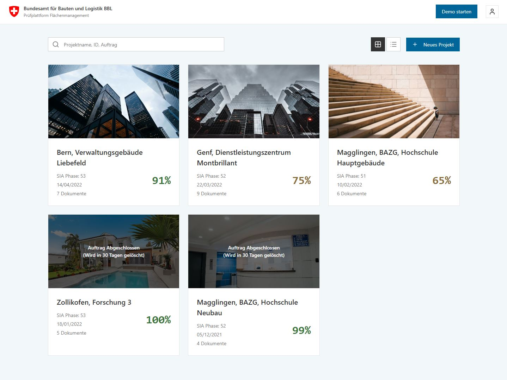

# plan-check

**BBL Prüfplattform Flächenmanagement** - A validation tool for floor plan drawings following Swiss Federal BBL CAD standards and SIA 416 area calculations.

## Live Demo

Visit the interactive prototype: **[https://davras5.github.io/plan-check/](https://davras5.github.io/plan-check/)**

> The demo is a static HTML/CSS/JavaScript prototype showcasing the user interface and workflow. Upload, check, and ensure data quality for DWG/DXF floor plans.

<p align="center">
  
  
</p>

## Project Overview

This project aims to replace/modernize the existing BBL floor plan validation platform with an open-source solution that validates DWG/DXF files against BBL CAD-Richtlinie standards before CAFM import.

**Target Users:**
- BBL internal staff (Flächenmanagement team)
- External planners/architects submitting floor plans
- Project managers reviewing submissions

**Current Status:** Frontend prototype (production-ready), backend planned

## Features

### Frontend Prototype (Live Demo)
- **Swiss Federal Design System** - Official colors, typography, and layouts
- **Project Dashboard** - Grid/list view with searchable project cards
- **Document Management** - Upload and track DWG/DXF/XLSX files with size validation
- **4-Step Validation Workflow** - Upload DWG → Upload Room List → Review Results → Submit
- **Interactive Floor Plan Viewer** - Visual error markers on plans (Speckle integration)
- **SIA 416 Area Calculations** - Complete area breakdowns (GF, NGF, HNF, NNF, VF, FF)
- **Validation Results** - Detailed error/warning list with severity levels
- **User Management** - Role-based access (Admin, Editor, Viewer)
- **Accessibility** - WCAG 2.1 AA compliant with keyboard navigation

### Security Features
- HTML escaping (XSS prevention)
- Filename sanitization (path traversal prevention)
- Content Security Policy headers
- File size validation on uploads
- Input validation and sanitization

### Planned Backend Features
- DWG/DXF file processing (Speckle or LibreDWG)
- 25+ validation rules from BBL CAD-Richtlinie
- Excel room list cross-validation
- Real-time validation progress
- PDF report generation
- Swiss eIAM authentication

## Repository Structure

```
plan-check/
├── index.html                 # Main application (GitHub Pages deployment)
├── test.html                  # Browser-based unit test runner
├── README.md                  # Project documentation
├── LICENSE                    # MIT License
├── assets/                    # Static images and logos
│   ├── Preview1.jpg           # UI screenshots
│   ├── Preview2.jpg
│   ├── Preview3.jpg
│   ├── logo.png               # BBL Logo
│   └── swiss-logo-flag.svg    # Swiss confederation symbol
├── css/                       # Stylesheets
│   ├── styles.css             # Main stylesheet (Swiss Federal Design System)
│   └── tokens.css             # CSS custom properties/design tokens
├── js/                        # JavaScript source code
│   ├── script.js              # Main application logic (~2200 lines)
│   └── script.test.js         # Unit tests (75+ test cases)
├── data/                      # Mock JSON data
│   ├── projects.json          # 5 sample building projects
│   ├── documents.json         # DWG/DXF/XLSX file metadata
│   ├── geometry.json          # Room polygons and area geometries
│   ├── rules.json             # 14 validation rule definitions
│   ├── results.json           # Validation error results
│   └── users.json             # 11 sample user accounts
└── documentation/             # Comprehensive documentation
    ├── requirements.md        # Functional & non-functional requirements
    ├── data-model.md          # Entity relationships & schema definitions
    ├── styleguide.md          # Swiss Federal Design System guide
    ├── typography-tokens.md   # CSS typography utilities
    └── research/              # Architecture and hosting research
```

## Technology Stack

### Frontend (Current - Production Ready)
| Technology | Purpose |
|------------|---------|
| HTML5 | Semantic markup |
| CSS3 | Custom properties, Grid, Flexbox |
| Vanilla JavaScript | No build tools required |
| Lucide Icons | MIT-licensed icon library (CDN) |

### CSS Architecture
- **Design System:** Swiss Federal Corporate Design
- **Methodology:** BEM naming convention
- **Tokens:** 30+ color variables, 8 font sizes, 8 spacing units
- **Grid:** 12-column responsive system
- **Breakpoints:** Mobile (576px), Tablet (768px), Desktop (992px), Large (1200px)

### Backend (Planned)
| Technology | Purpose |
|------------|---------|
| Python 3.12+ | Runtime |
| FastAPI | Web framework |
| Speckle / LibreDWG | DWG processing |
| ezdxf | DXF fallback |
| Shapely | Geometry operations |
| openpyxl | Excel parsing |
| PostgreSQL + PostGIS | Database |
| Swiss eIAM | Authentication |

## Getting Started

### View the Demo
Simply visit: **[https://davras5.github.io/plan-check/](https://davras5.github.io/plan-check/)**

### Run Locally
```bash
# Clone the repository
git clone https://github.com/davras5/plan-check.git
cd plan-check

# Option 1: Open directly in browser
open index.html

# Option 2: Use a local server (recommended)
python -m http.server 8000
# Visit http://localhost:8000
```

### Run Tests
```bash
# Open test runner in browser
open test.html

# Or navigate to http://localhost:8000/test.html
```

The test suite includes 75+ test cases covering:
- Security utilities (XSS prevention, path traversal)
- Parsing utilities (safe integer parsing)
- UI utilities (status icons, file size formatting)
- State management (AppState validation)
- Configuration validation
- Score status calculations
- Event listener management

## Configuration

Key configuration options in `js/script.js`:

```javascript
const CONFIG = {
    TOAST_DURATION_MS: 3000,           // Toast notification timing
    STEP_COUNT: 4,                      // Validation workflow steps
    MAX_IMAGE_SIZE: 10 * 1024 * 1024,  // 10 MB for project images
    MAX_DWG_SIZE: 50 * 1024 * 1024,    // 50 MB for DWG files
    MAX_EXCEL_SIZE: 10 * 1024 * 1024,  // 10 MB for Excel files
    SCORE_SUCCESS_THRESHOLD: 90,        // Green status threshold
    SCORE_WARNING_THRESHOLD: 60,        // Yellow status threshold
    SEARCH_DEBOUNCE_MS: 300,           // Search input debounce
};
```

## Design System

The prototype follows the **Swiss Federal Corporate Design** guidelines:

| Element | Specification |
|---------|---------------|
| Primary Color | Venetian Red (#DC0018) |
| Secondary Color | Cerulean Blue (#006699) |
| Typography | Frutiger font family (with system fallbacks) |
| Spacing | 8px base unit system |
| Grid | 12-column responsive layout |
| Accessibility | WCAG 2.1 AA compliant |

See [documentation/styleguide.md](documentation/styleguide.md) for complete design specifications.

## Data Model

The application uses a normalized data structure with 6 entities:

```
User → Project → Document → Geometry (Rooms/Areas)
                         → ValidationResult
                         → RuleSet
```

| Entity | Description |
|--------|-------------|
| Project | Building projects with SIA phase (31-53) |
| Document | DWG/DXF/XLSX files with validation scores |
| Geometry | Room polygons and area calculations |
| RuleSet | Validation rules by category |
| Result | Error/warning messages with locations |
| User | Accounts with roles (Admin/Editor/Viewer) |

See [documentation/data-model.md](documentation/data-model.md) for complete schema definitions.

## Demo Workflow

1. **Login** - Enter credentials (demo mode, any input works)
2. **Project Dashboard** - Browse projects with completion percentages and search
3. **Project Detail** - View documents, users, and validation rules
4. **Validation Workflow** - Step through the 4-stage process:
   - **Step 1:** Upload DWG file, view extracted rooms
   - **Step 2:** Upload Excel room list, compare with DWG
   - **Step 3:** Review SIA 416 area calculations and viewer
   - **Step 4:** Submit and complete validation
5. **Results** - See detailed error reports with severity indicators

## Documentation

| Document | Description |
|----------|-------------|
| [requirements.md](documentation/requirements.md) | Functional requirements (FR-1 to FR-10) |
| [styleguide.md](documentation/styleguide.md) | Swiss Federal Design System guide |
| [data-model.md](documentation/data-model.md) | Database schema and entity definitions |
| [typography-tokens.md](documentation/typography-tokens.md) | Typography CSS utilities |

## Roadmap

### Phase 1: Backend MVP
- [ ] Set up FastAPI backend
- [ ] Implement DWG file upload and storage
- [ ] Build validation engine (5 core rules)
- [ ] Create REST API endpoints
- [ ] Connect frontend to backend

### Phase 2: Full Validation
- [ ] Implement all 25+ validation rules
- [ ] Excel room list cross-validation
- [ ] AOID format and uniqueness checks
- [ ] Room extraction and area calculations
- [ ] PDF report generation

### Phase 3: Production Ready
- [ ] Swiss eIAM authentication
- [ ] Multi-language support (DE, FR, IT)
- [ ] Performance optimization
- [ ] Security hardening
- [ ] Deployment to Swiss federal infrastructure

## References

- [Swiss Federal Design System](https://github.com/swiss/designsystem)
- [SIA 416 - Areas and Volumes of Buildings](https://www.sia.ch/de/dienstleistungen/sia-norm/sia-416/)
- [DIN 277 - Floor Areas and Volumes](https://www.din.de/)
- [WCAG 2.1 Accessibility Guidelines](https://www.w3.org/TR/WCAG21/)
- [Lucide Icons](https://lucide.dev/)

## License

MIT License - See [LICENSE](LICENSE) for details.

---

**Built with:** HTML5, CSS3, Vanilla JavaScript
**Design System:** Swiss Federal Corporate Design
**Icons:** Lucide Icons (MIT)
**Last Updated:** January 2026
