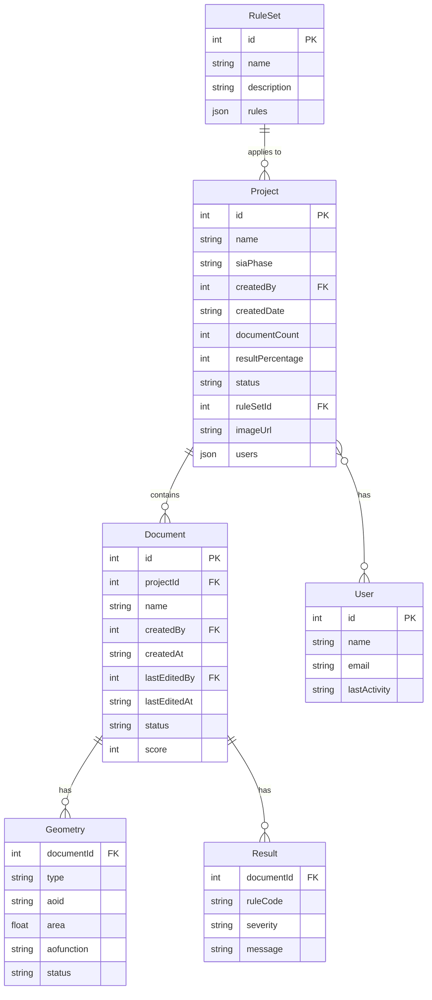

# plan-check Data Model

## Overview

This document defines the data model for the BBL Prüfplattform Flächenmanagement prototype. Data is stored as JSON files in the `data/` directory and loaded at runtime.

---

## Entity Relationship Diagram



### Relationships Summary

| Relationship | Cardinality | Foreign Key |
|--------------|-------------|-------------|
| RuleSet → Project | One-to-Many | `project.ruleSetId` |
| Project ↔ User | Many-to-Many | `project.users[].userId` |
| Project → Document | One-to-Many | `document.projectId` |
| Document → Geometry | One-to-Many | `geometry.documentId` |
| Document → Result | One-to-Many | `result.documentId` |

---

## JSON Files

The prototype uses the following JSON files:

```
data/
├── projects.json      # Project list
├── documents.json     # Documents linked to projects
├── geometry.json      # Polygon geometries (rooms + areas) linked to documents
├── rules.json         # Rule sets with validation rules ("Prüfregeln")
├── results.json       # Validation results ("Fehlermeldungen") linked to documents
└── users.json         # User list for project access
```

---

## 1. Project

Represents a building project containing floor plan documents.

### Schema

```typescript
interface Project {
  id: number;                      // Simple numeric ID
  name: string;                    // Project name (format: "Location, Building Name")
  siaPhase: '31' | '32' | '33' | '41' | '51' | '52' | '53';  // SIA 112 phase code
  createdBy: number;               // Foreign key to User who created the project
  createdDate: string;             // Display date (DD/MM/YYYY)
  documentCount: number;           // Total documents in project
  resultPercentage: number;        // 0-100, average validation score
  status: 'active' | 'completed';
  ruleSetId: number;               // Foreign key to RuleSet
  imageUrl: string;                // Building photo URL
  users: ProjectUser[];            // Users with access to this project
}

interface ProjectUser {
  userId: number;                  // Foreign key to User
  role: 'Admin' | 'Editor' | 'Viewer';  // Role within this project
}
```

### Example (data/projects.json)

```json
[
  {
    "id": 1,
    "name": "Bern, Verwaltungsgebäude Liebefeld",
    "siaPhase": "53",
    "createdBy": 3,
    "createdDate": "14/04/2022",
    "documentCount": 7,
    "resultPercentage": 91,
    "status": "active",
    "ruleSetId": 1,
    "imageUrl": "https://images.unsplash.com/photo-1486406146926-c627a92ad1ab?w=800&auto=format&fit=crop",
    "users": [
      { "userId": 1, "role": "Admin" },
      { "userId": 3, "role": "Editor" },
      { "userId": 5, "role": "Viewer" }
    ]
  }
]
```

### SIA Phase Codes

Based on SIA 112 (Leistungsmodell):

| Phase | German Name | English | Goals |
|-------|-------------|---------|-------|
| 31 | Vorprojekt | Preliminary Project | Concept and cost-effectiveness optimized |
| 32 | Bauprojekt | Design Development | Project and costs optimized, schedule defined |
| 33 | Bewilligungsverfahren / Auflageprojekt | Permit Application | Project approved, costs and schedule verified, building loan approved |
| 41 | Ausschreibung, Offertvergleich, Vergabe | Tendering & Contracting | Purchase and work contracts concluded |
| 51 | Ausführungsprojekt | Construction Documents | Construction readiness achieved |
| 52 | Ausführung | Construction | Building constructed per specifications and contract |
| 53 | Inbetriebsetzung, Abschluss | Commissioning & Closeout | Building handed over and operational, final accounting completed |

---

## 2. Document

Represents an uploaded DWG/DXF floor plan or Excel room list.

### Schema

```typescript
interface Document {
  id: number;                      // Simple numeric ID
  projectId: number;               // Foreign key to Project
  name: string;                    // Filename
  createdBy: number;               // Foreign key to User who uploaded the document
  createdAt: string;               // Upload timestamp (DD/MM/YYYY HH:mm)
  lastEditedBy: number;            // Foreign key to User who last edited
  lastEditedAt: string;            // Last edit timestamp (DD/MM/YYYY HH:mm)
  status: 'validated' | 'processing' | 'pending';
  score: number;                   // Validation score 0-100
}
```

### Example (data/documents.json)

```json
[
  {
    "id": 1,
    "projectId": 1,
    "name": "Erdgeschoss (EG).dwg",
    "createdBy": 3,
    "createdAt": "10/04/2022 09:30",
    "lastEditedBy": 3,
    "lastEditedAt": "14/04/2022 14:20",
    "status": "validated",
    "score": 94
  }
]
```

### Relationships

- `document.projectId` links to `project.id` - A project can have many documents
- `document.createdBy` links to `user.id` - The user who uploaded the document
- `document.lastEditedBy` links to `user.id` - The user who last modified the document

---

## 3. Geometry (Räume & Flächen)

Represents polygon geometries extracted from DWG floor plans. All polygons are stored in a single file and differentiated by `type`:

- **`type: "room"`** - Individual room polygons (shown in "Räume" tab)
- **`type: "area"`** - Building area polygons like BGF, EBF (shown in "Flächen" tab)

### Schema

```typescript
interface Geometry {
  documentId: number;              // Foreign key to Document
  type: 'room' | 'area';           // Geometry type for filtering
  aoid: string;                    // Polygon identifier
  area: number;                    // Area in m²
  aofunction: string;              // Function/type name
  status: 'ok' | 'warning' | 'error';  // Validation status
}
```

### Example (data/geometry.json)

```json
[
  { "documentId": 1, "type": "room", "aoid": "EG.01", "area": 24.50, "aofunction": "conference", "status": "ok" },
  { "documentId": 1, "type": "room", "aoid": "EG.02", "area": 18.30, "aofunction": "office", "status": "ok" },
  { "documentId": 1, "type": "room", "aoid": "EG.03", "area": 22.10, "aofunction": "office", "status": "error" },
  { "documentId": 1, "type": "room", "aoid": "EG.07", "area": 45.20, "aofunction": "hall", "status": "ok" },
  { "documentId": 1, "type": "area", "aoid": "BGF-EG-001", "area": 450.00, "aofunction": "Brutto Geschossfläche", "status": "ok" },
  { "documentId": 1, "type": "area", "aoid": "EBF-EG-001", "area": 280.00, "aofunction": "Energiebezugsfläche", "status": "ok" }
]
```

### Relationship

- `geometry.documentId` links to `document.id`
- A document can have many geometry entries

### Room Functions (type: "room")

Common room function values:
- `office` - Büro
- `conference` - Konferenzraum
- `meeting` - Sitzungszimmer
- `storage` - Lager
- `WC` - Sanitärraum
- `hall` - Flur/Korridor

### Area Types (type: "area")

| Code | German | Description |
|------|--------|-------------|
| BGF | Brutto Geschossfläche | Gross floor area polygon (typically 1 per floor) |
| EBF | Energiebezugsfläche | Energy reference area polygons (can be multiple) |

**Note:** Only BGF and EBF are drawn as polygons in the CAD file. Other SIA 416 area types (NGF, VF, NNF, etc.) are calculated values, not drawn geometries.

### Realistic Area Ratios

Per SIA 416, the sum of room areas (Nettogeschossfläche/NGF) should typically be **75-85%** of BGF. The test data uses realistic values:

| Floor | BGF | Sum of Rooms | Ratio |
|-------|-----|--------------|-------|
| EG (Doc 1) | 450 m² | ~345 m² | 77% |
| 1.OG (Doc 2) | 435 m² | ~333 m² | 77% |
| UG (Doc 5) | 320 m² | ~268 m² | 84% |

The remaining ~15-25% accounts for walls, structural elements, and circulation space not counted as usable room area.

---

## 4. RuleSet (Prüfregeln)

Represents a set of validation rules applied to a project. Each project references one rule set.

### Schema

```typescript
interface RuleSet {
  id: number;                      // Simple numeric ID
  name: string;                    // Rule set name
  description: string;             // Description of the rule set
  rules: Rule[];                   // Array of validation rules
}

interface Rule {
  code: string;                    // Rule code (e.g., "LAYER_001")
  name: string;                    // Rule name
  category: string;                // Category (Layer, Geometrie, Entität, Text, AOID)
  description: string;             // Description of what the rule checks
}
```

### Example (data/rules.json)

```json
[
  {
    "id": 1,
    "name": "BBL CAD-Richtlinie Standard",
    "description": "Standard-Prüfregeln für BBL CAD-Zeichnungen",
    "rules": [
      { "code": "LAYER_001", "name": "Pflichtlayer vorhanden", "category": "Layer", "description": "Prüft, ob alle 14 vorgeschriebenen Layer gemäss BBL CAD-Richtlinie vorhanden sind" },
      { "code": "LAYER_002", "name": "Layer-Farben korrekt", "category": "Layer", "description": "Prüft, ob die Layer-Farben den Vorgaben entsprechen (z.B. Layer 7 = weiss)" },
      { "code": "LAYER_003", "name": "Keine fremden Layer", "category": "Layer", "description": "Prüft, ob keine nicht definierten Layer in der Zeichnung vorhanden sind" },
      { "code": "GEOM_001", "name": "Polylinien geschlossen", "category": "Geometrie", "description": "Prüft, ob alle Raumpolygone geschlossen sind (Start- und Endpunkt identisch)" },
      { "code": "GEOM_002", "name": "Polylinien planar", "category": "Geometrie", "description": "Prüft, ob alle Polylinien auf Z=0 liegen (2D-Konformität)" },
      { "code": "GEOM_003", "name": "Keine Selbstüberschneidungen", "category": "Geometrie", "description": "Prüft, ob Raumpolygone sich nicht selbst überschneiden" },
      { "code": "GEOM_004", "name": "Minimale Raumgrösse", "category": "Geometrie", "description": "Prüft, ob alle Räume eine Mindestfläche von 1 m² haben" },
      { "code": "ENTITY_001", "name": "Erlaubte Entitätstypen", "category": "Entität", "description": "Prüft, ob nur erlaubte Entitätstypen verwendet werden (LINE, POLYLINE, TEXT, etc.)" },
      { "code": "ENTITY_002", "name": "Keine OLE-Objekte", "category": "Entität", "description": "Prüft, ob keine eingebetteten OLE-Objekte vorhanden sind" },
      { "code": "TEXT_001", "name": "Schriftart korrekt", "category": "Text", "description": "Prüft, ob nur die vorgeschriebene Schriftart \"Arial\" verwendet wird" },
      { "code": "TEXT_002", "name": "Textgrösse korrekt", "category": "Text", "description": "Prüft, ob die Texthöhe den Vorgaben entspricht (min. 2.5mm)" },
      { "code": "AOID_001", "name": "AOID-Format gültig", "category": "AOID", "description": "Prüft, ob alle AOIDs dem BBL-Format entsprechen (z.B. \"2011.DM.04.015\")" },
      { "code": "AOID_002", "name": "AOID eindeutig", "category": "AOID", "description": "Prüft, ob jede AOID nur einmal in der Zeichnung vorkommt" },
      { "code": "AOID_003", "name": "AOID in Raumliste", "category": "AOID", "description": "Prüft, ob alle AOIDs in der hochgeladenen Excel-Raumliste vorhanden sind" }
    ]
  }
]
```

### Relationship

- `project.ruleSetId` links to `ruleSet.id`
- A rule set can be used by many projects

### Rule Categories

| Category | German | Description |
|----------|--------|-------------|
| Layer | Layer | Layer structure and naming conventions |
| Geometrie | Geometrie | Geometric validation (closed polygons, planar, etc.) |
| Entität | Entität | Entity type validation |
| Text | Text | Text formatting (font, size) |
| AOID | AOID | Room identifier validation |

---

## 5. Result (Fehlermeldungen)

Represents validation results/errors for a document. These appear in the "Fehlermeldungen" tab.

### Schema

```typescript
interface Result {
  documentId: number;              // Foreign key to Document
  ruleCode: string;                // Reference to rule code (e.g., "LAYER_001")
  severity: 'error' | 'warning' | 'info';  // Severity level
  message: string;                 // Human-readable error message
}
```

### Example (data/results.json)

```json
[
  { "documentId": 1, "ruleCode": "LAYER_001", "severity": "error", "message": "Pflichtlayer \"A-WAENDE\" fehlt in der Zeichnung" },
  { "documentId": 1, "ruleCode": "GEOM_001", "severity": "error", "message": "Raumpolygon EG.03 ist nicht geschlossen (Lücke: 2.3mm)" },
  { "documentId": 1, "ruleCode": "AOID_001", "severity": "warning", "message": "AOID EG.06 entspricht nicht dem BBL-Format" }
]
```

### Relationship

- `result.documentId` links to `document.id`
- `result.ruleCode` references `rule.code` in the rule set
- A document can have many validation results

### Severity Levels

| Severity | German | Description |
|----------|--------|-------------|
| error | Fehler | Must be fixed before approval |
| warning | Warnung | Should be reviewed |
| info | Info | Informational note |

---

## 6. User (Benutzer)

Represents users who can be assigned to projects.

### Schema

```typescript
interface User {
  id: number;                      // Simple numeric ID
  name: string;                    // Display name
  email: string;                   // Email address
  lastActivity: string;            // Last activity timestamp (DD/MM/YYYY HH:mm)
}
```

### Example (data/users.json)

```json
[
  { "id": 1, "name": "Max Muster", "email": "max.muster@bbl.admin.ch", "lastActivity": "27/06/2022 12:30" },
  { "id": 2, "name": "Anna Müller", "email": "anna.mueller@architekten-zuerich.ch", "lastActivity": "27/06/2022 10:45" },
  { "id": 3, "name": "Peter Schmidt", "email": "p.schmidt@geometer-bern.ch", "lastActivity": "14/04/2022 16:30" },
  { "id": 5, "name": "Maria Keller", "email": "m.keller@elektroplanung-gmbh.ch", "lastActivity": "14/04/2022 10:30" }
]
```

### User Roles (per project)

Roles are assigned per project in the `project.users[]` array:

| Role | German | Description |
|------|--------|-------------|
| Admin | Administrator | Full access, can manage project users |
| Editor | Bearbeiter | Can upload and validate documents |
| Viewer | Betrachter | Read-only access |

---

## Data Loading

Data is loaded at application startup via `loadData()` in `script.js`:

```javascript
async function loadData() {
    const [projectsRes, documentsRes, geometryRes, rulesRes, resultsRes, usersRes] = await Promise.all([
        fetch('data/projects.json'),
        fetch('data/documents.json'),
        fetch('data/geometry.json'),
        fetch('data/rules.json'),
        fetch('data/results.json'),
        fetch('data/users.json')
    ]);

    mockProjects = await projectsRes.json();
    mockDocuments = await documentsRes.json();
    mockGeometry = await geometryRes.json();
    mockRuleSets = await rulesRes.json();
    mockCheckingResults = await resultsRes.json();
    mockUsers = await usersRes.json();
}
```

### Filtering by Document and Type

When rendering rooms or areas for a specific document:

```javascript
// Filter rooms for current document
const documentRooms = mockGeometry.filter(g =>
    g.type === 'room' && g.documentId === currentDocument.id
);

// Filter areas for current document
const documentAreas = mockGeometry.filter(g =>
    g.type === 'area' && g.documentId === currentDocument.id
);
```

### Getting Rules for a Project

```javascript
// Get rule set for current project
const ruleSet = mockRuleSets.find(rs => rs.id === currentProject.ruleSetId);
const rules = ruleSet ? ruleSet.rules : [];
```

---

## Status Values

### Document Status
- `validated` - Validation complete
- `processing` - Validation in progress
- `pending` - Not yet validated

### Geometry Status
- `ok` - No issues (green checkmark)
- `warning` - Review needed (orange triangle)
- `error` - Must be fixed (red X)

---

## Adding Test Data

To add data for a new document:

1. Add the document to `documents.json` with a `projectId`
2. Add geometry entries to `geometry.json` with the document's `id` as `documentId`

Example: Adding data for document ID 2

```json
// documents.json
{ "id": 2, "projectId": 1, "name": "1. Obergeschoss (1.OG).dwg", ... }

// geometry.json - rooms (aim for ~75-85% of BGF as total room area)
{ "documentId": 2, "type": "room", "aoid": "1OG.01", "area": 35.80, "aofunction": "conference", "status": "ok" }
{ "documentId": 2, "type": "room", "aoid": "1OG.02", "area": 14.20, "aofunction": "office", "status": "ok" }
{ "documentId": 2, "type": "room", "aoid": "1OG.03", "area": 18.95, "aofunction": "office", "status": "ok" }
{ "documentId": 2, "type": "room", "aoid": "1OG.07", "area": 42.30, "aofunction": "hall", "status": "ok" }

// geometry.json - areas
{ "documentId": 2, "type": "area", "aoid": "BGF-1OG-001", "area": 435.00, "aofunction": "Brutto Geschossfläche", "status": "ok" }
{ "documentId": 2, "type": "area", "aoid": "EBF-1OG-001", "area": 265.00, "aofunction": "Energiebezugsfläche", "status": "ok" }
```

---

## Version History

| Version | Date | Changes |
|---------|------|---------|
| 1.0 | 2025-01-07 | Initial data model specification |
| 2.0 | 2025-01-09 | Simplified for prototype - removed unused entities, added areas.json |
| 2.1 | 2025-01-09 | Added rules.json for validation rule sets (Prüfregeln) |
| 3.0 | 2025-01-09 | Merged rooms.json and areas.json into geometry.json with type field |
| 3.1 | 2025-01-09 | Added results.json for validation results, users.json for user management |
| 3.2 | 2025-01-09 | Updated test data with realistic area values (BGF ~300-550 m², room totals 75-85% of BGF) |
| 4.0 | 2026-01-09 | Added Project-User relationships: createdBy, members[] on projects; createdBy, createdAt, lastEditedBy, lastEditedAt on documents |

---

## References

- [SIA 416 Standard](https://www.sia.ch/de/dienstleistungen/sia-norm/sia-416/) - Area calculation methodology
- [DIN 277](https://www.din.de/) - Area and volume classifications
